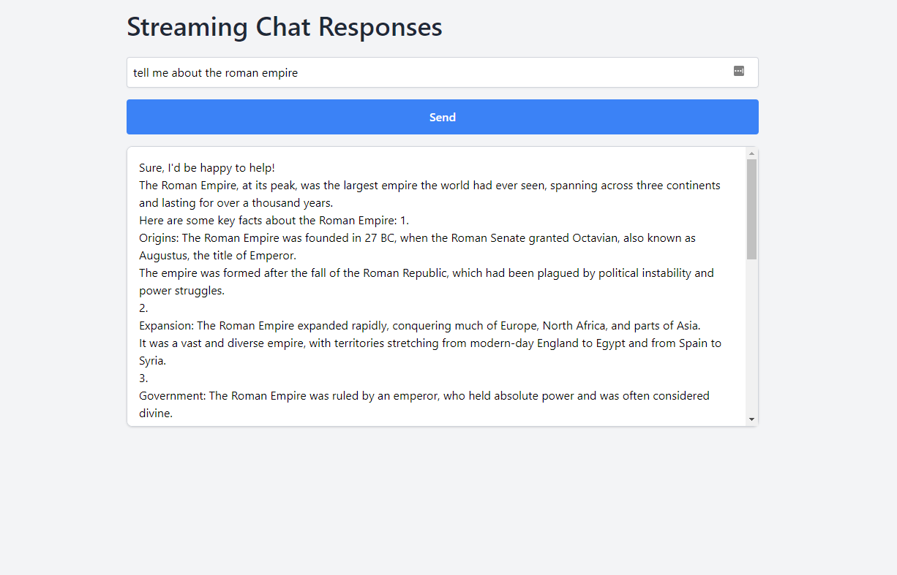

# Groq Chat

Groq Chat is a simple chat application that utilizes the Groq language model for providing chat completions.



## Table of Contents
- [Groq Chat](#groq-chat)
  - [Table of Contents](#table-of-contents)
  - [Introduction](#introduction)
  - [Features](#features)
  - [Installation](#installation)
  - [Obtaining a Groq API Key](#obtaining-a-groq-api-key)
    - [Configuring the API Key in Groq Chat](#configuring-the-api-key-in-groq-chat)
  - [Usage](#usage)
  - [Testing](#testing)
  - [Contributing](#contributing)
  - [License](#license)

## Introduction

Groq Chat is built using Node.js, Express.js, and the Groq language model. It allows users to interact with a chat interface and receive chat completions based on the Groq model's predictions.

## Features

- Real-time chat completions
- Server-side error handling
- Responsive design

## Installation

1. Clone the repository:

   ```bash
   git clone https://github.com/stevenmcsorley/groq-chat.git
   ```

2. Install dependencies:

   ```bash
   cd groq-chat
   npm install
   ```
## Obtaining a Groq API Key

To utilize the Groq language model in Groq Chat, you need to obtain a free API key from Groq. Here's how to get your key:

1. Visit Groq's website and sign up for an account. Visit [Groq's website](https://wow.groq.com/) and sign up for an account.
2. Once logged in, navigate to the API section and request a free API key.
3. After receiving your API key, store it securely. You will need to configure it in the Groq Chat application.

### Configuring the API Key in Groq Chat

Add the API key to your environment variables or directly into the application's configuration file. Ensure the key is kept secure and not exposed publicly.


## Usage

1. Start the server:

   ```bash
   npm start
   ```

2. Open your web browser and navigate to `http://localhost:3000`.

3. Start chatting and see chat completions in real-time!

## Testing

To run the tests, use the following command:

```bash
npm test
```

## Contributing

Contributions are welcome! Please fork the repository and submit a pull request with your changes.

## License

This project is licensed under the [MIT License](LICENSE).
